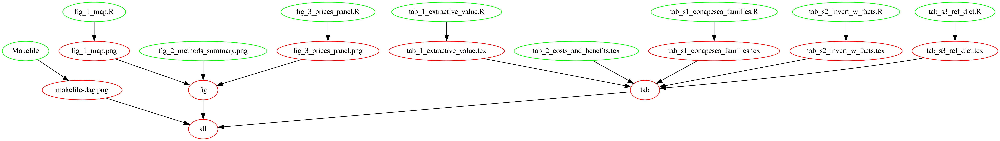

# Code and data for: Biomass accrual benefits of community-based marine protected areas outweigh their operational costs

## Repository structure

- All R code can be found under `scripts/` folder.
- All data are available in the `data/*` sub-folders (`raw`, `processed`, and `output`)
- All figures and tables are exported in the `results` folder


Additionally, a DAG is provided:



## Reproducibility notes

All data analyses were conducted in R within RStudio. All packages are listed in
the `renv.loc` file. In your R console. You can install the exact same packages
and versions used in the development of this project by running the following
lines of code:

```
if(!require(renv)){install.packages("renv")}
renv::restore()
```

The project also contains a `Makefile` listing the dependency and relationship
between code and output files. You can execute the entire project by running
`make -B` in your terminal.

## System and session info

```
> Sys.info()
                                                                                           sysname 
                                                                                          "Darwin" 
                                                                                           release 
                                                                                          "22.5.0" 
                                                                                           version 
"Darwin Kernel Version 22.5.0: Thu Jun  8 22:22:22 PDT 2023; root:xnu-8796.121.3~7/RELEASE_X86_64" 
                                                                                          nodename 
                                                                   "HMS-C02CH1S8MD6T.stanford.edu" 
                                                                                           machine 
                                                                                          "x86_64" 
                                                                                             login 
                                                                                            "root" 
                                                                                              user 
                                                                      "juancarlosvillasenorderbez" 
                                                                                    effective_user 
                                                                      "juancarlosvillasenorderbez" 
```

```
> sessionInfo()
R version 4.3.1 (2023-06-16)
Platform: x86_64-apple-darwin20 (64-bit)
Running under: macOS Ventura 13.4.1

Matrix products: default
BLAS:   /System/Library/Frameworks/Accelerate.framework/Versions/A/Frameworks/vecLib.framework/Versions/A/libBLAS.dylib 
LAPACK: /Library/Frameworks/R.framework/Versions/4.3-x86_64/Resources/lib/libRlapack.dylib;  LAPACK version 3.11.0

locale:
[1] en_US.UTF-8/en_US.UTF-8/en_US.UTF-8/C/en_US.UTF-8/en_US.UTF-8

time zone: America/Los_Angeles
tzcode source: internal

attached base packages:
[1] stats     graphics  grDevices datasets  utils     methods   base     

loaded via a namespace (and not attached):
 [1] utf8_1.2.3        R6_2.5.1          tidyselect_1.2.0  magrittr_2.0.3    gtable_0.3.3     
 [6] glue_1.6.2        tibble_3.2.1      pkgconfig_2.0.3   generics_0.1.3    dplyr_1.1.2      
[11] lifecycle_1.0.3   ggplot2_3.4.2     cli_3.6.1         fansi_1.0.4       scales_1.2.1     
[16] grid_4.3.1        vctrs_0.6.3       renv_0.17.3       compiler_4.3.1    rstudioapi_0.15.0
[21] tools_4.3.1       munsell_0.5.0     pillar_1.9.0      colorspace_2.1-0  rlang_1.1.1 
```